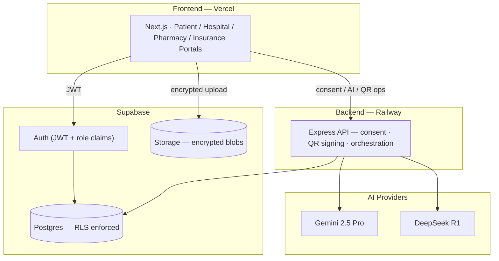

<div align="center">

# 🩺 HealthMesh AI

### Patient-Owned Healthcare Trust Network

**Own Your Health. Control Your Access. Trust Every Interaction.**

[](https://nextjs.org/)
[](https://www.typescriptlang.org/)
[](https://supabase.com/)
[](https://expressjs.com/)
[](https://tailwindcss.com/)
[](#license)

<sub>Built for the <a href="https://unstop.com/hackathons/vertexa-hackhere-1686997">Vertexa Hackathon</a> — add date here</sub>

</div>

---

## 📖 Table of Contents

- [The Problem](#-the-problem)
- [Our Solution](#-our-solution)
- [Core Modules](#-core-modules)
- [Novelty Features](#-novelty-features)
- [Tech Stack](#-tech-stack)
- [System Architecture](#-system-architecture)
- [Screenshots](#-screenshots)
- [Getting Started](#-getting-started)
- [Project Structure](#-project-structure)
- [Security Model](#-security-model)
- [Demo Flow](#-demo-flow)
- [Roadmap](#-roadmap)
- [Team](#-team)
- [License](#-license)

---

## 🧩 The Problem

Healthcare data today is fragmented across hospitals, pharmacies, laboratories, and insurance
providers — and patients rarely have real visibility or control over who accesses their own
records.

- **Fragmented records** — no single source of truth across providers
- **No patient ownership** — patients can't see who accessed their data, or why
- **Prescription fraud** — forged or tampered prescriptions are hard to catch
- **Emergency access gaps** — consent can't always be given when it's needed most
- **Poor continuity** — patients re-explain their medical history at every new provider
- **Over-sharing by default** — institutions often receive more data than necessary

## 💡 Our Solution

**HealthMesh AI** is a **patient-owned healthcare trust layer** — not another EHR, not an AI
doctor, not a hospital management system. It's the infrastructure that sits *between*
patients, hospitals, pharmacies, and insurers, so that:

- Patients **own** access to their records — institutions must **request** it.
- Every access is **scoped**, **time-boxed**, and **revocable**.
- Every action is **cryptographically verifiable** and **immutably logged**.
- AI improves **safety**, **fraud detection**, and **healthcare continuity** — it never
  gatekeeps access and never diagnoses.

> **We are not building another healthcare database.**
> **We are building the trust infrastructure for the future of healthcare.**

## 🗂 Core Modules

| Module | What it does |
|---|---|
| **Patient Health Vault** | Encrypted, categorized storage for prescriptions, lab reports, allergies, and insurance documents |
| **Consent & Access Control Engine** | Patients approve, scope, time-box, and revoke every access request |
| **Prescription Intelligence Layer** | Cryptographically signed QR prescriptions, instantly verifiable by any pharmacy |
| **AI Safety Engine** | Drug interaction, duplicate medication, and allergy conflict detection |
| **Healthcare Continuity Engine** | AI-generated medical history summaries and emergency profiles |
| **Audit & Compliance Center** | Immutable, searchable log of every access — who, what, when, why |

## ✨ Novelty Features

- 🚨 **Emergency Break-Glass Access** — time-limited, fully logged, patient-notified
- 📱 **Prescription QR Capsules** — signed, forgery-resistant, instantly verifiable
- ⏳ **Consent Expiry Timer** — one-time, 24h, one week, until discharge, or custom
- 🎯 **Selective Data Sharing** — share only what's needed (e.g. allergies only)
- 🔐 **Cryptographic Audit Trail** — insert-only, immutable, fully transparent
- 👥 **Delegated Consent Network** — trusted parents/guardians/spouses can act on a patient's behalf
- 🗣 **AI Prescription Explanation Engine** — plain-language medicine explanations
- 🧾 **Consent Receipt System** — a digital receipt for every approved access
- 🕵️ **AI Counterfeit Prescription Detector** — flags forged signatures and tampered records
- 🔁 **Cryptographic Handshake Access Transfer** — transfer access without copying records
- 🕸 **Prescription Relationship Graph** — visualizes diseases, medicines, allergies, and treatments
- 💊 **AI Continuity Capsule** — *"The patient never has to explain their medical history again."*

## 🛠 Tech Stack

**Frontend** · Next.js 15 · React · TypeScript · Tailwind CSS · shadcn/ui · Framer Motion · React Three Fiber + Drei
**Backend** · Node.js · Express.js
**Database** · Supabase (PostgreSQL · Auth · Storage · Realtime)
**AI** · Gemini 2.5 Pro (explanations, safety checks, continuity capsules) · DeepSeek R1 (fraud & counterfeit detection)
**Automation** · n8n · Flowise
**Deployment** · Vercel (frontend) · Railway (backend)

## 🏗 System Architecture



A patient's records are visible to anyone else **only** through an approved, scoped,
non-expired `consent_grant` — enforced at the **database level** via Postgres Row Level
Security, not just in application code.

## 📸 Screenshots

> _Add screenshots or a demo GIF here — e.g. the Patient Dashboard, Consent Decision Sheet,
> and Pharmacy QR Verification screens make a strong first impression._

| Dashboard | Consent Center | Prescription Verification |
|---|---|---|
| _add image_ | _add image_ | _add image_ |

## 🚀 Getting Started

### Prerequisites
- Node.js 18+
- pnpm
- A Supabase project (Postgres + Auth + Storage)
- Gemini and DeepSeek API keys

### 1. Clone & install
```bash
git clone https://github.com/<your-org>/healthmesh-ai.git
cd healthmesh-ai
pnpm install
```

### 2. Environment variables
Create `.env.local` in `apps/web` and `.env` in `apps/api` from the templates:
```bash
cp apps/web/.env.example apps/web/.env.local
cp apps/api/.env.example apps/api/.env
```

| Variable | Where | Description |
|---|---|---|
| `NEXT_PUBLIC_SUPABASE_URL` | web | Supabase project URL |
| `NEXT_PUBLIC_SUPABASE_ANON_KEY` | web | Supabase anon/public key |
| `SUPABASE_SERVICE_ROLE_KEY` | api | Server-only Supabase key — never expose to the client |
| `GEMINI_API_KEY` | api | Gemini 2.5 Pro API key |
| `DEEPSEEK_API_KEY` | api | DeepSeek R1 API key |
| `QR_SIGNING_SECRET` | api | HMAC secret for prescription QR signing |

### 3. Set up the database
```bash
supabase start
supabase db push
supabase db seed
```

### 4. Run locally
```bash
pnpm --filter web dev      # Next.js on localhost:3000
pnpm --filter api dev      # Express on localhost:4000
```

## 📁 Project Structure

```
healthmesh-ai/
├── apps/
│   ├── web/            # Next.js frontend — Patient/Hospital/Pharmacy/Insurance portals
│   └── api/             # Express backend — consent, QR signing, AI orchestration
├── packages/
│   ├── ui/               # Shared design-system components
│   └── shared/          # zod schemas + generated Supabase types
├── supabase/
│   ├── migrations/      # Versioned SQL schema + RLS policies
│   └── seed.sql         # Demo data
└── docs/                 # Architecture notes, audit docs, roadmap
```

## 🔒 Security Model

- **End-to-end encryption** — records are encrypted client-side before upload; the server
  never sees plaintext.
- **Row Level Security** — access is enforced at the database layer, not just the API.
- **Immutable audit log** — every action is logged to an insert-only table with no
  update/delete policy.
- **Cryptographically signed prescriptions** — HMAC-signed QR tokens, verified server-side.
- **Time-boxed, revocable consent** — every grant has a scope and an expiry, enforced on read.

## 🎬 Demo Flow

1. Patient uploads a prescription to their encrypted Vault.
2. A hospital requests access; the patient approves with a scoped, 24-hour grant.
3. The hospital views the record — access expires automatically, live, on screen.
4. A pharmacy scans the prescription's QR — verified instantly; a tampered one is rejected.
5. An emergency Break-Glass access is triggered and logged in real time.
6. The patient's AI Continuity Capsule summarizes their full medical history in one view.

## 🗺 Roadmap

- [ ] Cryptographic Handshake Access Transfer
- [ ] Prescription Relationship Graph (interactive visualization)
- [ ] Delegated Consent Network — full multi-delegate workflows
- [ ] Mobile app companion
- [ ] Multi-language AI explanations

## 👥 Team

| Name | 
|---|
| **Adithyan J** 
| **Pradnya Sundar** 
| **Ishack S** 
| **Taarunya Giriraj** 

## 📄 License

This project is licensed under the [MIT License](LICENSE).

---

<div align="center">
<sub>HealthMesh AI — moving trust, not just records.</sub>
</div>
